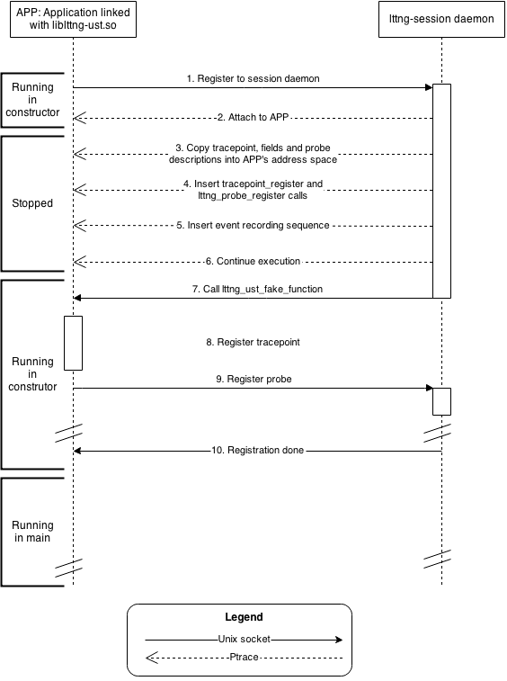

# lttng-dynamic-instrumentation
## Current status

In its current state, the project's main feature is the ability to run the lttng trace command. Using the '-f' argument, the user can specify which function in the application he wants to trace. It then runs the application with a tracepoint at the entry and exit of this function.

<pre>
$>lttng trace -f traverse_trace_dir babeltrace ~/lttng-traces/auto-20140814-142257/                                     
Trace directory: net://localhost/host/gamma/auto-20140814-153705

[15:37:14.911798248] (+?.?????????) gamma dyn-tp:traverse_trace_dir_entry: { cpu_id = 3 }, { vpid = 2499 }, { _fpath_length = 47, fpath = "/home/frdeso/lttng-traces/auto-20140814-142257", sb = 0x7FFFEB6518D0, tflag = 1, ftwbuf = 0x7FFFEB651898 }
[15:37:14.911829051] (+0.000030803) gamma dyn-tp:traverse_trace_dir_exit: { cpu_id = 3 }, { vpid = 2499 }, { }
[15:37:14.911846871] (+0.000017820) gamma dyn-tp:traverse_trace_dir_entry: { cpu_id = 3 }, { vpid = 2499 }, { _fpath_length = 54, fpath = "/home/frdeso/lttng-traces/auto-20140814-142257/kernel", sb = 0x7FFFEB6516A0, tflag = 1, ftwbuf = 0x7FFFEB651898 }
[15:37:14.911859183] (+0.000012312) gamma dyn-tp:traverse_trace_dir_exit: { cpu_id = 3 }, { vpid = 2499 }, { }
[15:37:14.911869613] (+0.000010430) gamma dyn-tp:traverse_trace_dir_entry: { cpu_id = 3 }, { vpid = 2499 }, { _fpath_length = 65, fpath = "/home/frdeso/lttng-traces/auto-20140814-142257/kernel/channel0_2", sb = 0x7FFFEB651540, tflag = 0, ftwbuf = 0x7FFFEB651898 }
[15:37:14.911871701] (+0.000002088) gamma dyn-tp:traverse_trace_dir_exit: { cpu_id = 3 }, { vpid = 2499 }, { }
[15:37:14.911879393] (+0.000007692) gamma dyn-tp:traverse_trace_dir_entry: { cpu_id = 3 }, { vpid = 2499 }, { _fpath_length = 60, fpath = "/home/frdeso/lttng-traces/auto-20140814-142257/kernel/index", sb = 0x7FFFEB651540, tflag = 1, ftwbuf = 0x7FFFEB651898 }
[15:37:14.911884451] (+0.000005058) gamma dyn-tp:traverse_trace_dir_exit: { cpu_id = 3 }, { vpid = 2499 }, { }
[15:37:14.911889628] (+0.000005177) gamma dyn-tp:traverse_trace_dir_entry: { cpu_id = 3 }, { vpid = 2499 }, { _fpath_length = 75, fpath = "/home/frdeso/lttng-traces/auto-20140814-142257/kernel/index/channel0_0.idx", sb = 0x7FFFEB6513E0, tflag = 0, ftwbuf = 0x7FFFEB651898 }
[15:37:14.911891326] (+0.000001698) gamma dyn-tp:traverse_trace_dir_exit: { cpu_id = 3 }, { vpid = 2499 }, { }
[15:37:14.911893043] (+0.000001717) gamma dyn-tp:traverse_trace_dir_entry: { cpu_id = 3 }, { vpid = 2499 }, { _fpath_length = 75, fpath = "/home/frdeso/lttng-traces/auto-20140814-142257/kernel/index/channel0_3.idx", sb = 0x7FFFEB6513E0, tflag = 0, ftwbuf = 0x7FFFEB651898 }
[15:37:14.911894626] (+0.000001583) gamma dyn-tp:traverse_trace_dir_exit: { cpu_id = 3 }, { vpid = 2499 }, { }
[15:37:14.911896565] (+0.000001939) gamma dyn-tp:traverse_trace_dir_entry: { cpu_id = 3 }, { vpid = 2499 }, { _fpath_length = 75, fpath = "/home/frdeso/lttng-traces/auto-20140814-142257/kernel/index/channel0_1.idx", sb = 0x7FFFEB6513E0, tflag = 0, ftwbuf = 0x7FFFEB651898 }
[15:37:14.911898026] (+0.000001461) gamma dyn-tp:traverse_trace_dir_exit: { cpu_id = 3 }, { vpid = 2499 }, { }
[15:37:14.911899785] (+0.000001759) gamma dyn-tp:traverse_trace_dir_entry: { cpu_id = 3 }, { vpid = 2499 }, { _fpath_length = 75, fpath = "/home/frdeso/lttng-traces/auto-20140814-142257/kernel/index/channel0_2.idx", sb = 0x7FFFEB6513E0, tflag = 0, ftwbuf = 0x7FFFEB651898 }
[15:37:14.911901256] (+0.000001471) gamma dyn-tp:traverse_trace_dir_exit: { cpu_id = 3 }, { vpid = 2499 }, { }
[15:37:14.911908823] (+0.000007567) gamma dyn-tp:traverse_trace_dir_entry: { cpu_id = 3 }, { vpid = 2499 }, { _fpath_length = 63, fpath = "/home/frdeso/lttng-traces/auto-20140814-142257/kernel/metadata", sb = 0x7FFFEB651540, tflag = 0, ftwbuf = 0x7FFFEB651898 }
[15:37:14.911910373] (+0.000001550) gamma dyn-tp:traverse_trace_dir_exit: { cpu_id = 3 }, { vpid = 2499 }, { }
[15:37:14.911912170] (+0.000001797) gamma dyn-tp:traverse_trace_dir_entry: { cpu_id = 3 }, { vpid = 2499 }, { _fpath_length = 65, fpath = "/home/frdeso/lttng-traces/auto-20140814-142257/kernel/channel0_3", sb = 0x7FFFEB651540, tflag = 0, ftwbuf = 0x7FFFEB651898 }
[15:37:14.911913680] (+0.000001510) gamma dyn-tp:traverse_trace_dir_exit: { cpu_id = 3 }, { vpid = 2499 }, { }
[15:37:14.911915293] (+0.000001613) gamma dyn-tp:traverse_trace_dir_entry: { cpu_id = 3 }, { vpid = 2499 }, { _fpath_length = 65, fpath = "/home/frdeso/lttng-traces/auto-20140814-142257/kernel/channel0_0", sb = 0x7FFFEB651540, tflag = 0, ftwbuf = 0x7FFFEB651898 }
[15:37:14.911916751] (+0.000001458) gamma dyn-tp:traverse_trace_dir_exit: { cpu_id = 3 }, { vpid = 2499 }, { }
[15:37:14.911918508] (+0.000001757) gamma dyn-tp:traverse_trace_dir_entry: { cpu_id = 3 }, { vpid = 2499 }, { _fpath_length = 65, fpath = "/home/frdeso/lttng-traces/auto-20140814-142257/kernel/channel0_1", sb = 0x7FFFEB651540, tflag = 0, ftwbuf = 0x7FFFEB651898 }
[15:37:14.911919938] (+0.000001430) gamma dyn-tp:traverse_trace_dir_exit: { cpu_id = 3 }, { vpid = 2499 }, { }

^CWaiting for data availability
Tracing stopped for session auto-20140814-125539
Session auto-20140814-125539 destroyed
</pre>

The user can also list the functions that can be instrumented in the binary:

<pre> 
$> lttng trace -l babeltrace                                                                                                                                                                                     
list_formats(FILE *fp)
usage(FILE *fp)
strlower(char *str)
get_names_args(poptContext *pc)
get_fields_args(poptContext *pc)
parse_options(int argc,  *argv)
traverse_trace_dir(const char *fpath, const stat *sb, int tflag, FTW *ftwbuf)
trace_pre_handler(bt_trace_descriptor *td_write, bt_context *ctx)
trace_post_handler(bt_trace_descriptor *td_write, bt_context *ctx)
convert_trace(bt_trace_descriptor *td_write, bt_context *ctx)
_init()
_start()
bt_context_add_traces_recursive(bt_context *ctx, const char *path, const char *format_str,  *packet_seek)
main(int argc,  *argv)
__libc_csu_init()
__libc_csu_fini()
_fini()
__do_global_dtors_aux()
frame_dummy()
</pre>

## Working

1. Instrument function entry
2. Retrieve function parameter type
3. Retrieve function parameter name
4. Retrieve function parameter value
5. Instrument function exit

## Limitations

1. Application must be linked or LD_PRELOADed with liblttng-ust.so

## Not working

1. Inserting multiple dynamic tracepoints
2. Removing dynamic tracepoints
3. Disabling dynamic tracepoints
4. Probe instrumentation
5. Detaching and reattaching to the same process. Dyninst doesn't keep any mapping of the memory address used in the previous attach, which means reattaching and writing to the tracee's address space will overwrite previously copied data.
6. Tracing floating point parameter
7. Tracing function calls to a dynamic library (e.g. malloc)

## Known bugs

1. Triggering a tracepoint if the session has not started.

## TODO

1. Add probe instrumentation (easy)
2. Probe registration moved to the session daemon (hard)

## How is it done?

### Overview

1. When the dynamic loader loads the liblttng-ust.so library in the application's address space, the constructor of the library is called. It is at this point that the application is registered with the session daemon. Information about the application, such as the process name and process ID, is sent to the session daemon.
2. The session daemon receives the name of the process and sees that it matches a dynamic tracepoint enabled in the current session. It uses Dyninst to attach to the process. This puts the application in the stopped status.
3. At this point, the session is attached to the process and has access to the application's whole address space. Using Dyninst, the session daemon retrieves the targeted function and its parameters' names and types through the debugging symbols. Using this, tracepoint and probe structures are dynamically generated and copied into the application's address space.
4. To register a tracepoint, the tracepoint_register and lttng_probe_register functions must be called from the application. Therefore, we hook calls to these functions to an empty function in the application. This function is called lttng_ust_fake_function and has the for only purpose being hooked onto for the registration of tracepoints. A detailed explanation of this step is given in the following section.
5. The session daemon adds instrumentation on the function entry to record an event. The recording of an event is made in three main steps: initializing a context in the ringbuffer, write the data for each field, and commit the event These three steps must be done in this order each time the event is triggered. Those function calls are hooked to the targeted function's entry.
6. All of the required changes to the application are done. The session daemon can now continue the execution of the application.
7. Through a Unix socket, the session daemon sends a command to call the lttng_ust_fake_function. This call will trigger the calls that were added in step 4.
8. The tracepoint_register function is called.
9. The lttng_probe_register function is called.
10. After sending any other enabled static tracepoints, the session daemon sends a "Registration done" command which specifies that the app can exit liblttng-ust.so's constructor and eventually start executing the main function.

### Tracepoint registration

This tracepoint registration process comprises three main actions. First, there is the tracepoint registration, followed by the probe registration, and finally setting the registered flag to TRUE. The registered flag must be set to TRUE in order for the tracepoint recording sequence to be enabled (see next section). This call sequence was hooked to the lttng_ust_fake_function at step #4 of the previous section.

#### Pseudo-code

<pre>

bool isTpRegistered = false;

registerTP();

registerProbe();

completeRegistration(){
	isTpRegistered = true;
}

lttng_ust_fake_function{
	registerTP();
	registerProbe();
	completeRegistration();
}

</pre>

### Event recording

To trace an event requires four steps. First, the total length of the event's fields has to be computed. This sum is not static since some CTF fields are of variable length (e.g. ctf_sequence). Afterwards, a ringbuffer of the determined length has to be initialized. Then, each field is written to the ringbuffer. Finally, we commit the context. Once a context is committed, it can be consumed by the consumer daemon, who in turn writes it to a file. Notice that writing and committing the context are only done if the context is initialized.

N.B. The following pseudo-code makes it look as though function calls are added inside the target function. It is doubtful that this is how Dyninst really does it, but it simplifies the explanation.

#### Pseudo-code

<pre>
bool isCtxReady = false;
int event_len = 0;
Context ctx;

void addIntLen(){
	event_len += sizeof(int);
}

void addCharLen(){
	event_len += sizeof(char);
}

void InitCtx(){
	//We need event length to reserve
	//space in the context ringbuffer
	if(isTpRegistered){
		init(ctx, event_len);
		IsCtxReady = true;
	}
}

void writeIntField(int value){
	if(!isCtxReady)
		return;
	write(ctx, &value);	
}
void writeCharField(char value){
	if(!isCtxReady)
		return;
	write(ctx, &value);	
}

void commitEvent(){
	if(!isCtxReady)
		return;
	commit(ctx);
}

void interestingFunction(int a, char b){
	addIntLen();
	addCharLen();
	InitCtx();
	writeIntField(a);
	writeCharField(b);
	commitEvent();
	//... original function
}
</pre>

### Dyninst

Dyninst is a powerful library that can retrieve information from, modify the address space, and inject code in a running process. This prototype uses Dyninst to copy data structures in the tracee's address space, and to add calls to functions for the tracepoint registration and event recording.

website: http://www.dyninst.org/

git: http://git.dyninst.org/ 

### Structures

N.B. The following explanation uses a tracepoint named prov:name which has one integer (32 bits) field, and one char (8 bits) field.

In order to register a tracepoint, at least four structures must be constructed:

The tracepoint structure describes its name and signature. Only those two fields are used in this implementation of dynamic instrumentation. The name and signature fields which are respectively "prov:name" and "name" in our example.

<pre>
struct tracepoint {
	const char *name;
	int state;
	struct tracepoint_probe *probes;
	int *tracepoint_provider_ref;
	const char *signature;
	char padding[TRACEPOINT_PADDING];
};
</pre>

The following structure describes the tracepoints related to a provider. The "provider" field in this case would be set to "prov". The nr_events is set to the number of events for this provider. The field event_desc points to an array of nr_events event descriptions.

<pre>
struct lttng_probe_desc {
	const char *provider;
	const struct lttng_event_desc **event_desc;
	unsigned int nr_events;
	struct cds_list_head head;		/* chain registered probes */
	struct cds_list_head lazy_init_head;
	int lazy;				/* lazy registration */
	uint32_t major;
	uint32_t minor;
	enum lttng_probe_type type;
	char padding[LTTNG_UST_PROBE_DESC_PADDING];
};
</pre>

This structure represents a tracepoint. At the moment, we are interested in its name, its number of fields, and its array of field descriptions.

<pre>
struct lttng_event_desc {
	const char *name;
	void (*probe_callback)(void);
	const struct lttng_event_ctx *ctx;	/* context */
	const struct lttng_event_field *fields;	/* event payload */
	unsigned int nr_fields;
	const int **loglevel;
	const char *signature;	/* Argument types/names received */
	union {
		struct {
			const char **model_emf_uri;
		} ext;
		char padding[LTTNG_UST_EVENT_DESC_PADDING];
	} u;
};
</pre>

This structure describes a field. In this implementation, the name and type are useful. In our example, we would have a fields of type 32- and 8-bit integers.

<pre>
struct lttng_event_di_field {
	const char *name;
	struct lttng_type type;
	unsigned int nowrite;	/* do not write into trace */
	char padding[LTTNG_UST_EVENT_FIELD_PADDING];
};
</pre>
